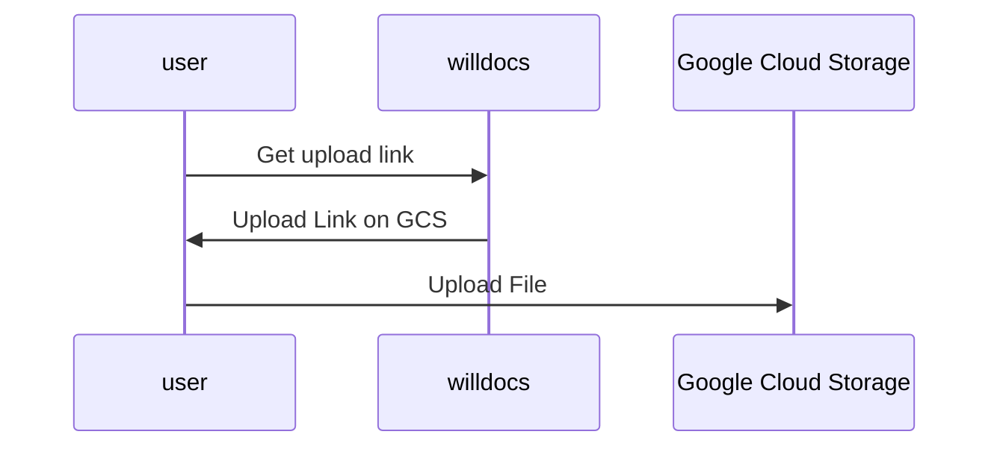

# Multi Media Documents

## Status

Accepted

## Context

Uploading media files into documents is a core requirement for shared document editing.

## Media Uploads

Drag and drop files onto a document to upload them.

Once uploaded, insert a img component tag into the document.  When the document is previewed it should download the file from the GCS bucket and display it.