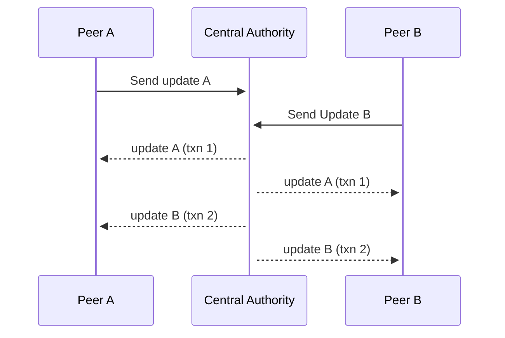
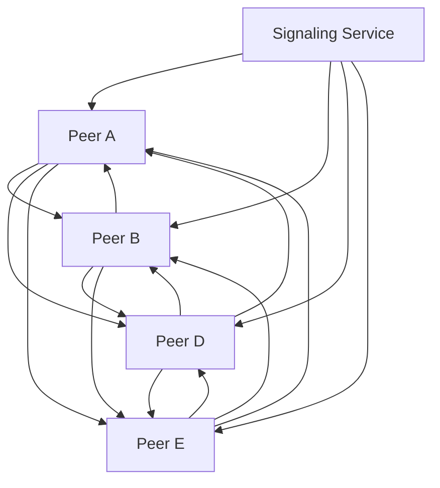

# Collabrative Text Editor

Building an application on top of shared mutable state.

---

# [CAP Theorem](https://en.wikipedia.org/wiki/CAP_theorem)

<div>

>
> It is impossible for a distributed
> data store to simultaneously provide
> more than two out of the following
> three guarantees:
>
>
> * Consistency
> * Availability
> * Partition Tolerance

</div>

---

<div>

# OT

Operational Transformation

</div>

---




Requires a central authority to order all of the transactions

---

# Transport Layer

websockets

---

> ... there's a hack that works simply and efficiently,
> but completely falls apart when you add more
> requirements. OT is such a hack.
>
> -- Marijn Haverbeke


[Collaborative Editing in CodeMirror](https://marijnhaverbeke.nl/blog/collaborative-editing-cm.html)

---

codemirror 6 has native support for OT

https://codemirror.net/6/examples/collab/

---

<strong>CRDTs</strong>

Conflict-free Replicated Data Types

* Completely Distributed Architecture
* Peers can talk directly to each other
* Much lower server load

---

Much higher storage costs then OT

---

Lots of interesting work is being done in this field:

---

## [Automerge](https://github.com/automerge/automerge)

barebones network agnostic CRDT

---

## [YJS](https://github.com/yjs/yjs)

CRDT backed text editor

---

## [Hyper Core](https://hypercore-protocol.org/)

CRDT based on the DAT protocol

---

# Transport Layer

WebRTC

---

WebRTC :yikes:



---

## Demo

# [http://bingobongo.ml/document/f7f86c84-7d2d-44de-a783-89740fcc2637/](http://bingobongo.ml/document/f7f86c84-7d2d-44de-a783-89740fcc2637/)

---

find this on github
https://github.com/chewnoill/collaborative-editor


---


```
export default function Editor() {
  const ref = React.useRef();
  React.useEffect(() => {
    const ydoc = new Y.Doc();
    const provider = new WebrtcProvider("new-room", ydoc);
    const yText = ydoc.getText("codemirror");
    const yUndoManager = new Y.UndoManager(yText);

    const editor = CodeMirror(ref.current, {
      mode: "markdown",
      lineNumbers: true,
    });

    new CodemirrorBinding(yText, editor, provider.awareness, {
      yUndoManager,
    });
  }, [ref]);
  return &lt;div ref={ref} />;
}
```
