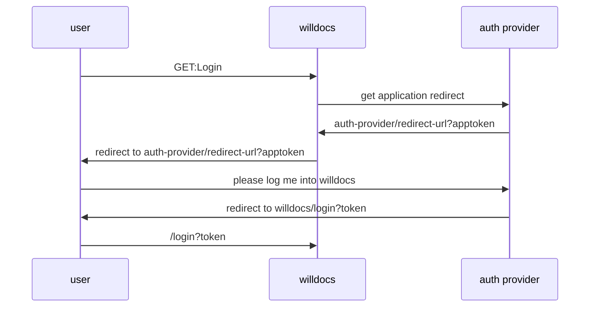

## Adding passport authentication providers

see [passportjs](https://www.passportjs.org/packages/)

Authentication Providers
---

| Provider | repo url                                         |
| -------- | ------------------------------------------------ |
| Github   | https://github.com/cfsghost/passport-github      |
| Google   | https://github.com/mstade/passport-google-oauth2 |
