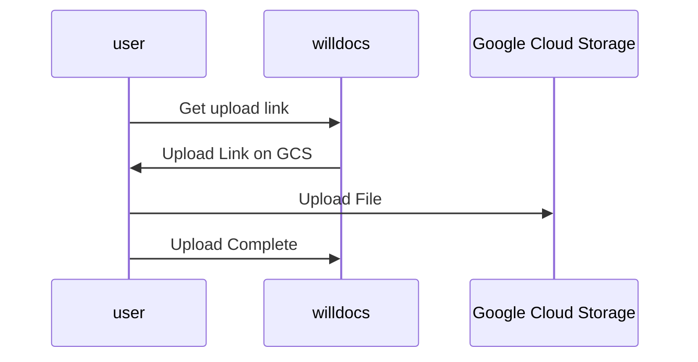

# Document Upload

Story Outline:
- [ ] (Prerequisite) Provision a storage bucket and access credentials
- [ ] (Server Side) Create a endpoint that returns upload links
- [ ] (Server Side) fetch a get link to object on GCS, suitable for rendering in an img tag on the client
- [ ] (Client Side) Connect File drop editor events to fetching the upload link and doing the file upload
- [ ] (Client Side) Display images in documents
